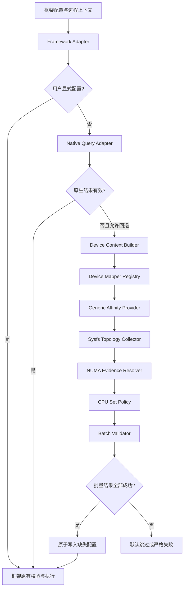
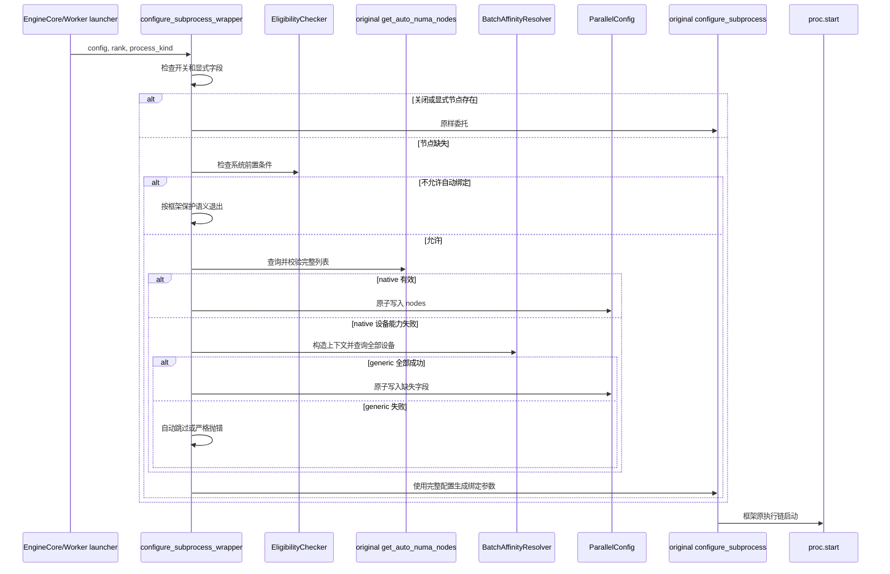

# 鲲鹏 GPU 亲和性插件正式交付设计与实施规范

## 文档说明

本文是鲲鹏 CPU 平台 GPU 亲和性插件的正式交付设计和实施基线，用于指导编码、集成、测试、发布和后续维护。上位方案《鲲鹏 CPU 平台 vLLM / SGLang GPU 亲和性绑核软件方案设计》规定需求、原则和总体方向；本文在不改变上位方案目标的前提下，补齐可执行的软件架构、模块接口、算法约束、框架接入、开发步骤、当前实现状态和验收出口。发生冲突时，需求和总体原则以上位方案为准，插件接口、实现步骤和交付验收以本文为准。

本文采用以下状态术语，避免把设计目标和已完成实现混为一谈：

| 状态 | 含义 |
|---|---|
| 已确认 | 已通过目标版本源码或公开接口核对，属于当前兼容性事实。 |
| 已实现 | 已存在可执行代码，并至少通过单元测试。 |
| 已验证 | 已在对应层级完成独立交叉验证；模拟环境与真实硬件分别标注。 |
| 拟实现 | 本文规定的正式实现要求，尚未全部落地。 |
| 待验证 | 设计已明确，但缺少目标框架、目标设备或目标拓扑的完整运行证据。 |

本文不包含具体服务器、网络地址、用户目录、容器名称、模型路径或测试环境的唯一标识。部署环境信息和原始测试数据应进入受控测试报告，不进入通用设计规范。

## 1. 目标与范围

### 1.1 建设目标

插件为 vLLM、SGLang 等推理框架补充通用 GPU CPU 亲和性发现能力。当框架已有 GPU 厂商查询成功时沿用原结果；当已有查询不支持目标设备或无法返回有效结果时，插件根据可信 PCIe BDF 和 Linux sysfs 拓扑计算 GPU 对应的 NUMA 节点与 CPU 集合，再复用框架原有绑定执行链。

核心目标如下：

1. 不修改框架源码，以独立 Python 包交付。
2. 保持原有启动命令，不构建替代 vLLM 或 SGLang 的新二进制。
3. 用户显式配置优先，框架原生查询次之，通用 Linux 查询作为回退。
4. BDF 之后的拓扑分析不依赖特定 GPU 厂商库或管理工具。
5. 使用同一父链遍历算法支持 GPU 直连、单级 PCIe Switch 和多级 PCIe Switch。
6. 结果受系统在线 CPU 和当前进程允许 CPU 集合约束。
7. 无法证明设备映射或 NUMA 归属时失败关闭，不猜测绑定目标。
8. 查询、决策和执行分层，插件不复制框架已有 `numactl`、`sched_setaffinity` 或 `libnuma` 执行逻辑。

### 1.2 第一阶段范围

第一阶段以 vLLM `v0.23.0` 为完整开发和验收基线，完成：

- 独立插件包和 `vllm.general_plugins` 自动加载；
- 逻辑设备到可信 BDF 的 Provider 扩展接口；
- 通用 PCIe/NUMA/CPU 拓扑分析；
- 显式配置、原生查询和通用查询的优先级决策；
- Worker 与 EngineCore 启动前的配置注入；
- 复用 vLLM 原有 `configure_subprocess()` 和 `numa_wrapper.sh`；
- 单元、契约、集成和硬件测试。

SGLang `v0.5.18` 作为后续框架适配基线。通用核心、Provider 和结果模型必须能够复用，但第一阶段不以 SGLang 适配完成作为 vLLM 交付阻塞条件。

### 1.3 非目标

以下内容不在本插件职责内：

- 修改 Linux 调度器、NUMA 内核策略或设备驱动；
- 实现通用 GPU 计算运行时或替代 GPU 厂商驱动；
- 根据 sysfs 枚举顺序猜测框架逻辑 GPU 顺序；
- 承诺 CPU 核独占；亲和性只限制允许运行的 CPU 集合；
- 在每个推理请求上重复分析拓扑；
- 自动修改容器权限、cgroup、systemd、Kubernetes 或主机配置；
- 在框架绑核开关关闭时擅自启用绑定；
- 吞掉用户配置错误、设备索引错误或框架绑定执行错误；
- 以模拟 PCIe Switch 测试替代真实 Switch 硬件验收。

## 2. 设计依据与兼容基线

### 2.1 上位原则

本规范复用上位方案中的以下核心设计：

1. `显式配置 -> 框架原生查询 -> 通用查询` 的决策顺序；
2. `逻辑 GPU -> 可信 BDF -> PCIe 父链 -> NUMA -> CPU 集合` 的数据链路；
3. Endpoint NUMA 优先、祖先属性回退、所有有效证据必须一致；
4. `node cpulist ∩ online CPUs ∩ current affinity` 的 CPU 集合算法；
5. `success / partial / failed` 的结构化结果；
6. 多设备批量结果 all-or-nothing；
7. 查询层与框架绑定执行层分离；
8. 模拟 sysfs、框架契约和真实硬件分层验收。

### 2.2 vLLM 兼容事实

以下结论以 vLLM `v0.23.0` 为基线：

| 事项 | 已确认行为 | 相对源码位置 |
|---|---|---|
| 绑定总开关 | `numa_bind` 默认为 `False`，需显式启用。 | `vllm/config/parallel.py` |
| 显式节点 | `numa_bind_nodes` 按可见 GPU 顺序提供节点。 | `vllm/config/parallel.py` |
| 显式 CPU | `numa_bind_cpus` 按可见 GPU 顺序提供 CPU list。 | `vllm/config/parallel.py` |
| 原生自动查询 | `get_auto_numa_nodes()` 调用当前平台的批量 NUMA 查询并带进程内缓存。 | `vllm/utils/numa_utils.py` |
| Worker 启动 | `proc.start()` 前动态访问 `numa_utils.configure_subprocess()`。 | `vllm/v1/executor/multiproc_executor.py` |
| EngineCore 启动 | `proc.start()` 前动态访问同一模块函数。 | `vllm/v1/engine/utils.py` |
| 插件入口 | `vllm.general_plugins` 由 `load_general_plugins()` 发现和执行。 | `vllm/plugins/__init__.py` |
| 插件加载时机 | 前端参数初始化和 EngineCore 初始化均早于对应子进程创建。 | `vllm/engine/arg_utils.py`、`vllm/v1/engine/core.py` |
| 绑定执行 | `configure_subprocess()` 临时替换 spawn executable，由 `numa_wrapper.sh` 执行 `numactl`。 | `vllm/utils/numa_utils.py` |

vLLM `v0.23.0` 没有公开的 NUMA Provider 注册接口。因此插件使用官方 general plugin 作为加载入口，再对受版本控制的内部函数安装 Hook。插件形式是标准 Python 插件，Hook 本身不是 vLLM 承诺长期稳定的公共 NUMA API，必须用兼容性检查和版本矩阵管理风险。

### 2.3 兼容策略

正式发布必须声明精确验证过的框架版本。兼容判断包括：

1. 包版本是否在支持矩阵中；
2. 目标模块和函数是否存在；
3. `configure_subprocess()` 参数名与语义是否匹配；
4. Worker 和 EngineCore 调用方是否仍动态访问模块属性；
5. 插件加载是否早于第一次 NUMA 查询和目标子进程启动；
6. 配置字段、GPU 索引计算和绑定参数语义是否保持一致。

任何一项不满足时，插件不得静默安装部分 Hook。自动模式下记录不兼容并保持框架原行为；严格模式下在启动早期报告兼容性错误。

## 3. 总体架构

### 3.1 分层结构



### 3.2 模块职责

| 模块 | 输入 | 输出 | 禁止承担的职责 |
|---|---|---|---|
| Framework Adapter | 框架配置、rank、进程类型 | 原生结果或通用结果的框架配置 | 不解析 PCIe 父链 |
| Eligibility Checker | 系统和框架前置条件 | 是否允许自动查询及原因 | 不查询具体 GPU NUMA |
| Device Context Builder | 框架可见设备上下文 | 有序 `DeviceContext` 列表 | 不按 sysfs 顺序枚举 GPU |
| Device Mapper | `DeviceContext` | 可信 `DeviceMapping` | 不决定 NUMA 和 CPU |
| Sysfs Topology Collector | 规范化 BDF | PCIe 父路径和原始属性 | 不执行绑定 |
| NUMA Evidence Resolver | 父路径、NUMA 节点清单 | 唯一 NUMA 节点或失败 | 不按距离猜测节点 |
| CPU Set Policy | NUMA CPU、online、allowed | 最终目标 CPU 集合 | 不扩大 allowed 集合 |
| Batch Validator | 单设备结果列表 | 可提交批量结果或整体失败 | 不提交部分列表 |
| Binding Executor | 框架配置 | 目标进程 affinity | 由框架原实现负责 |

### 3.3 核心依赖方向

```text
adapters -> orchestration -> providers -> topology -> core models
                         -> policy ------^          -> core errors
diagnostics 读取各层结果，但各核心层不反向依赖 diagnostics
```

框架相关类型只能出现在 `adapters` 层。`topology`、`policy` 和核心结果模型不得导入 vLLM、SGLang、PyTorch 或 GPU 厂商库。Provider 可以通过独立可选依赖访问设备运行时，但不得把厂商对象泄漏到通用核心接口。

## 4. 交付形式与代码组织

### 4.1 交付物

当前开发和跨环境验证以可克隆的源码仓库为主要交付载体，通过 editable install 向框架注册插件 entry point；该方式直接运行 checkout 中的源码，不要求预先构建 wheel。正式发布时可额外生成 wheel，作为版本化或离线安装制品，但 wheel 不是当前 Demo 验证的前置条件。

源码仓库及可选发布制品至少包含：

- 通用核心与 Linux sysfs 拓扑实现；
- Provider SPI 和目标 GPU Provider；
- vLLM 适配器及 general plugin entry point；
- 只读诊断 CLI；
- 单元测试、sysfs fixtures 和框架契约测试；
- 版本兼容矩阵、安装说明和测试报告模板。

源码 editable install 或 wheel 安装后继续使用原框架命令。对于 vLLM，用户仍需按框架语义启用 `--numa-bind`；安装插件本身不自动改变绑定开关。纯拓扑测试和真实主机只读探测可以直接通过 `PYTHONPATH` 运行，不要求安装插件；只有验证框架自动发现 entry point 时才必须安装。

### 4.2 建议目录

```text
kunpeng-affinity-plugin/
├── pyproject.toml
├── README.md
├── src/kunpeng_affinity/
│   ├── core/
│   │   ├── models.py
│   │   ├── errors.py
│   │   └── cpulist.py
│   ├── topology/
│   │   ├── sysfs.py
│   │   └── numa.py
│   ├── providers/
│   │   ├── base.py
│   │   ├── registry.py
│   │   ├── static_map.py
│   │   └── <target_provider>.py
│   ├── policy/
│   │   ├── cpu_set.py
│   │   └── batch.py
│   ├── adapters/
│   │   ├── vllm_v023.py
│   │   └── sglang_v0518.py
│   ├── diagnostics/
│   │   ├── logging.py
│   │   └── report.py
│   ├── plugin.py
│   └── cli.py
├── tests/
│   ├── fixtures/sysfs/
│   ├── unit/
│   ├── contract/
│   └── integration/
└── docs/
```

现有 Demo 中的 `topology/analyzer.py`、`topology/cpulist.py`、`topology/models.py` 和 `topology/cli.py` 可作为正式核心的起点。进入正式实现时应按上述职责拆分，而不是让单个 analyzer 同时承担文件读取、证据决策、CPU 策略和结果装配。

### 4.3 Python entry point

vLLM 第一阶段入口：

```toml
[project.entry-points."vllm.general_plugins"]
kunpeng_affinity = "kunpeng_affinity.plugin:activate_vllm"
```

入口函数只做以下工作：

1. 读取并校验插件配置；
2. 检查框架版本和目标函数契约；
3. 构造 Provider Registry；
4. 幂等安装 vLLM Adapter；
5. 记录安装结果。

入口函数不得扫描全部 PCIe 设备、调用 GPU 管理工具或提前计算拓扑。实际查询延迟到框架启用 NUMA 绑定且缺少必要自动结果时执行。

## 5. 领域模型与稳定接口

### 5.1 DeviceContext

`DeviceContext` 表示框架实际使用的一个逻辑设备。建议字段：

| 字段 | 类型 | 说明 |
|---|---|---|
| `framework` | `str` | 调用框架和适配器标识。 |
| `logical_device_id` | `int` | 当前可见设备空间中的逻辑编号。 |
| `runtime_device_id` | `str | int | None` | Provider 可识别的运行时设备标识。 |
| `device_node` | `str | None` | 可用于 sysfs 反查的 Linux 设备节点。 |
| `explicit_bdf` | `str | None` | 经部署配置提供的显式映射。 |
| `process_kind` | `str` | Worker、EngineCore 或其他框架进程类型。 |
| `local_rank` | `int | None` | 当前框架本地 rank。 |
| `visibility_fingerprint` | `str` | Provider 对当前设备可见性的稳定摘要。 |

该对象不包含 `ParallelConfig` 等框架内部实例，避免通用层与框架耦合。

### 5.2 DeviceMapping

`DeviceMapping` 只负责证明逻辑设备身份与 PCIe Function 的对应关系：

| 字段 | 说明 |
|---|---|
| `logical_device_id` | 输入逻辑设备编号。 |
| `physical_device_id` | Provider 的物理设备标识，可为空。 |
| `pci_bdf` | 规范化 `dddd:bb:ss.f`。 |
| `source` | `explicit-config`、`framework-context`、`device-node` 或 Provider 名。 |
| `evidence` | 用于诊断的非敏感证据摘要。 |
| `instance_id` | 分区设备实例标识，可为空。 |

默认要求不同逻辑设备映射到不同 BDF。对于 MIG、SR-IOV 或其他共享同一上游 Function 的设备实例，Provider 必须显式声明 `supports_shared_bdf=True` 并提供唯一 `instance_id`；否则重复 BDF 视为映射冲突。

### 5.3 PciPathNode

每一级父路径至少记录：

```text
bdf
canonical_sysfs_path
pci_class
role: endpoint | pci-bridge | pci-function | unknown
numa_node
local_cpulist
port_type (optional)
```

`port_type` 依赖 PCIe capability，可读时用于增强诊断；不可读时不得否定由 sysfs 目录关系证明的父子路径。

### 5.4 AffinityResult

正式 `AffinityResult` 建议采用不可变数据对象：

| 字段 | 说明 |
|---|---|
| `device` | 原始 `DeviceContext` 的稳定标识。 |
| `mapping` | 成功的 `DeviceMapping`，失败时可为空。 |
| `topology_path` | Endpoint 到 CPU 侧根总线的有序路径。 |
| `root_bus_path` | sysfs 中最上层 PCI 根总线表示。 |
| `numa_node` | 最终唯一 NUMA 节点。 |
| `numa_source` | Endpoint、具体祖先或 `local_cpulist`。 |
| `node_cpus` | NUMA 节点 CPU 集合。 |
| `online_cpus` | 查询时系统在线 CPU 集合。 |
| `allowed_cpus` | 查询上下文当前允许 CPU 集合。 |
| `target_cpus` | 三者交集。 |
| `result_source` | `explicit`、`native` 或 `generic`。 |
| `status` | `success`、`partial` 或 `failed`。 |
| `failure_stage` | mapping、topology、numa、cpu-policy、batch 或 integration。 |
| `diagnostics` | 稳定错误码及可读说明列表。 |

约束：

- 只有 `status=success` 且 `target_cpus` 非空的通用结果可进入绑定配置转换；
- `partial` 只供诊断，不可执行绑定；
- `failed` 必须带 `failure_stage` 和稳定错误码；
- 显式或原生结果允许没有完整 PCIe 路径，但必须说明来源；
- 序列化输出使用升序 Linux CPU list，内存中使用不可变整数集合。

### 5.5 BatchAffinityResult

批量对象包含：

```text
ordered_results
expected_device_count
visibility_fingerprint
committable
failure_summary
```

`committable=True` 的必要条件：

1. 结果数量与期望设备数量一致；
2. 逻辑编号连续且顺序正确；
3. 每个结果均为 `success`；
4. 每个节点有效且 CPU 交集非空；
5. BDF 唯一性或共享 BDF 实例规则满足；
6. 查询期间 visibility fingerprint 未变化。

任一设备失败时，不得向框架提交部分 `numa_bind_nodes` 或部分自动生成的 `numa_bind_cpus`。

## 6. 配置设计

### 6.1 配置来源

配置优先级建议为：

```text
框架用户显式亲和字段
  > 插件专用环境变量
  > 插件配置文件
  > 插件默认值
```

框架显式字段不由插件重新解释。插件配置只控制通用回退策略，不覆盖用户已提交给框架的节点或 CPU 列表。

### 6.2 插件配置项

建议稳定配置如下：

| 配置 | 值 | 默认 | 说明 |
|---|---|---|---|
| `mode` | `off / auto / strict` | `auto` | `auto` 失败时不增加绑定；`strict` 失败时终止；`off` 禁用通用回退。 |
| `provider` | `auto / <name>` | `auto` | 指定或自动选择 Device Mapper。 |
| `cpu_policy` | `node / exact` | `node` | `node` 只注入节点；`exact` 同时注入计算后的 Worker CPU list。 |
| `config_file` | 文件名 | 空 | 提供 Provider 参数和可选显式 BDF 映射。 |
| `diagnostic_level` | `error / summary / detail` | `summary` | 控制诊断粒度。 |
| `cache_topology` | `true / false` | `true` | 只缓存与进程 affinity 无关的静态拓扑事实。 |

约束：

- 插件仅在框架 NUMA 绑定开关已开启时运行；`mode=auto` 不等于自动开启框架绑核。
- `strict` 只提升插件发现错误，不改变用户配置错误和框架执行错误的类型。
- 配置文件未知字段、重复逻辑设备或非法 BDF 必须在启动阶段报错。
- 显式映射文件属于部署兜底能力，不能把未验证的 sysfs 枚举顺序写成映射。

## 7. Device Mapper 与 Provider SPI

### 7.1 为什么 Provider 边界不可省略

Linux sysfs 能描述已知 PCI Function 的父链、NUMA 和 CPU 局部性，但 Linux 没有定义任意 GPU 运行时“逻辑设备 0”到 PCI BDF 的统一映射。框架可见顺序还可能受设备过滤、容器映射、分区设备和运行时规则影响。因此：

```text
逻辑 GPU -> BDF：允许 Provider 相关，必须可证明
BDF -> NUMA/CPU：Linux 通用，不依赖 GPU 厂商
```

### 7.2 Provider 接口

```python
class DeviceMapper(Protocol):
    name: str

    def probe(self, context: MappingContext) -> ProbeResult: ...

    def map_all(
        self, contexts: Sequence[DeviceContext]
    ) -> Sequence[DeviceMapping]: ...
```

`probe()` 不得产生外部副作用。`map_all()` 必须按输入逻辑顺序返回完整结果，不能只返回成功子集。

### 7.3 映射来源优先级

1. 用户提供且通过双向校验的显式 BDF 映射；
2. 框架或硬件平台上下文直接提供的 BDF；
3. 目标设备节点经 `/sys/dev/char/<major>:<minor>/device` 或对应子系统链接解析得到的 BDF；
4. 目标 GPU Provider 的运行时设备查询；
5. 无法建立唯一映射时失败。

禁止使用：

- `/sys/bus/pci/devices` 字典序；
- PCI bus number 与逻辑 GPU ID 的数值关系；
- GPU 名称、显存大小或型号相同作为唯一身份；
- 只在单 GPU 环境成立的“逻辑 0 等于第一张 PCI 设备”假设。

### 7.4 Provider Registry

Registry 按以下规则选择 Provider：

1. 用户指定 Provider 时只探测该 Provider；
2. 自动模式调用所有已注册 Provider 的只读 `probe()`；
3. 恰好一个 Provider 明确支持时选用；
4. 零个支持时返回 `PROVIDER_NOT_FOUND`；
5. 多个 Provider 同时宣称支持时返回 `PROVIDER_AMBIGUOUS`，不按注册顺序猜测。

Provider 可作为插件包内部模块，也可预留独立 entry point 扩展。无论采用哪种方式，Provider 输出必须先经过核心 BDF 和 sysfs 校验，不能直接成为可绑定结果。

## 8. Linux sysfs 拓扑采集

### 8.1 BDF 规范化

接受以下形式：

```text
bb:ss.f
dddd:bb:ss.f
dddddddd:bb:ss.f
```

输出统一为小写 `dddd:bb:ss.f`。八位 domain 仅当高位全部为零且数值可由 Linux 四位 domain 表示时允许压缩；非零高位不得直接截断。bus、slot 和 function 必须满足 PCI 地址范围及格式约束。

### 8.2 Endpoint 定位与路径安全

1. 构造 `<sysfs-root>/bus/pci/devices/<BDF>`；
2. 使用严格模式解析符号链接；
3. 要求解析结果位于 `<sysfs-root>/devices` 内；
4. 要求真实路径 basename 仍等于规范化 BDF；
5. 读取过程只读，不跟随到 sysfs 根之外；
6. 链接不存在、循环、越界或身份不符时返回失败。

测试允许通过依赖注入替换 `<sysfs-root>`，生产默认使用系统 sysfs。不得通过全局常量把测试 fixture 路径泄漏到生产结果。

### 8.3 父链遍历

从 Endpoint 的真实目录开始循环：

```python
current = endpoint
while current is PCI function:
    record(current)
    if current.parent is PCI root-bus representation:
        record_root_bus(current.parent)
        break
    current = current.parent
```

算法不设置 Switch 层数上限。每次只移动到真实父目录，不扫描同级设备，不依据 bus number 拼接父节点。到达根总线前遇到非 PCI Function 目录、离开 sysfs devices 树或父子关系中断时，返回 `TOPOLOGY_PATH_INCOMPLETE`。

### 8.4 节点角色

最低识别规则：

- 路径第一个 PCI Function 标记为 Endpoint；
- PCI class `0x0604xx` 标记为 PCI-to-PCI Bridge；
- 其他 Function 保留 class 并标记为 `pci-function`；
- 根总线单独记录，不伪造不存在的 Root Complex BDF。

Root Port、Switch Upstream Port 和 Switch Downstream Port 可从 PCIe capability 补充。capability 不可读时 `port_type=unknown`，但只要 sysfs 父链完整，路径仍可用于 NUMA 证据分析。

### 8.5 sysfs 快照一致性

PCI 热插拔可能使查询期间节点消失。实现应：

1. 在一次查询开始时解析 Endpoint 真实路径；
2. 顺序读取同一父链；
3. 查询完成前再次确认 Endpoint 链接仍指向同一真实路径；
4. 若身份或 visibility fingerprint 变化，废弃结果并返回 `TOPOLOGY_CHANGED`；
5. 不在一次请求中混用变化前后的部分属性。

## 9. NUMA 证据解析

### 9.1 NUMA 节点清单

从 `<sysfs-root>/devices/system/node/nodeN/cpulist` 建立节点清单。节点目录存在但 `cpulist` 为空时表示 memory-only node，可以保留为系统事实，但不能作为最终 CPU 绑定节点。目标结果选择该节点时必须继续寻找其有效 CPU 邻近节点的明确证据；没有明确证据则失败，不按距离矩阵自行猜测。

### 9.2 证据来源

候选来源包括：

1. Endpoint `numa_node`；
2. Endpoint `local_cpulist` 唯一包含于某个 CPU NUMA node；
3. 从 Endpoint 最近祖先向 CPU 侧读取到的 `numa_node`；
4. 可选平台拓扑资料只用于测试交叉核对，不作为运行时无依据回退。

`numa_node=-1`、文件缺失和不可读均表示未知，不转换为 node 0。

### 9.3 决策规则

```text
收集所有有效候选
  -> 校验候选节点存在
  -> 校验目标节点有 CPU
  -> 所有可判定候选节点必须一致
  -> 选择来源标签：Endpoint > 最近祖先 > local_cpulist
```

来源优先级只决定成功结果的主来源标签，不允许用高优先级候选覆盖冲突候选。Endpoint 为 node 0、祖先为 node 1 时必须失败，而不是选择 Endpoint。

### 9.4 结果判定

| 情况 | 状态 | 是否可绑定 |
|---|---|---|
| 路径完整、节点唯一、节点有 CPU | `success` | 是 |
| 路径完整但所有 NUMA 证据未知 | `partial` | 否 |
| BDF 不存在或父链不完整 | `failed` | 否 |
| Endpoint、祖先或 local CPU 证据冲突 | `failed` | 否 |
| 节点不存在或目标节点没有 CPU | `failed` | 否 |

## 10. CPU 集合策略

### 10.1 基本算法

```text
target_cpus = node_cpus ∩ online_cpus ∩ allowed_cpus
```

其中：

- `node_cpus` 来自最终 NUMA node 的 `cpulist`；
- `online_cpus` 来自系统 CPU online 列表；
- `allowed_cpus` 来自目标启动上下文的 `sched_getaffinity(0)`；
- 三个集合均使用整数集合运算，最终再格式化为 Linux CPU list。

交集为空时返回 `CPU_SET_EMPTY`，不得退化为整个节点、整个机器或未受限 CPU 集合。

### 10.2 node 与 exact 策略

`cpu_policy=node`：

- 通用结果仍计算并记录 `target_cpus`；
- vLLM 适配器只自动写入 `numa_bind_nodes`；
- Worker 继续由 vLLM 生成 `--cpunodebind=<node> --membind=<node>`；
- 该策略最接近 vLLM 原生默认行为。

`cpu_policy=exact`：

- 自动写入 `numa_bind_nodes` 和完整 `numa_bind_cpus`；
- Worker 使用 `--physcpubind=<target> --membind=<node>`；
- EngineCore 仍按其 DP shard 涉及的 NUMA node 使用 CPU 超集，不能绑定到任一 Worker 的窄 CPU list；
- 用户显式提供 `numa_bind_cpus` 时插件不得覆盖。

第一版正式交付建议默认 `node`，先保持框架原语义；`exact` 在受限 cpuset、多 Worker 和 EngineCore 超集关系完成验证后再列为稳定能力。

### 10.3 查询时机

最终 `allowed_cpus` 与进程上下文有关，不得作为机器静态拓扑缓存。可以缓存 BDF 父链和节点 CPU 清单，但每次准备启动目标进程时必须重新读取 online 和 current affinity，再计算目标集合。

## 11. 自动决策与回退状态机

### 11.1 字段级优先级

| 框架绑核开关 | 显式节点 | 显式 CPU | 行为 |
|---|---|---|---|
| 关闭 | 任意 | 任意 | 完全保持框架原行为，不执行插件查询。 |
| 开启 | 有 | 无 | 保留显式节点，不查询 GPU NUMA。 |
| 开启 | 无 | 有 | 保留显式 CPU；仍需 native -> generic 补齐节点。 |
| 开启 | 有 | 有 | 完全沿用显式字段。 |
| 开启 | 无 | 无 | native -> generic 自动查询。 |

### 11.2 自动查询前置条件

通用回退不得仅以 `get_auto_numa_nodes() is None` 为条件，因为原函数将多种原因合并为 `None`。Adapter 必须把以下状态分开：

| 类别 | 示例 | 是否允许 generic 回退 |
|---|---|---|
| 用户未启用 | 框架绑定开关关闭 | 否 |
| 系统不适合绑定 | 只有一个 NUMA node、内存策略不可用 | 否 |
| 外部约束保护 | 框架基线规定已有 affinity 时跳过自动绑定 | 否，除非用户显式节点覆盖 |
| 执行工具缺失 | 原绑定执行器所需工具不存在 | 否 |
| 原生 Provider 不支持 | 当前平台没有可用 GPU NUMA 查询 | 是 |
| 原生设备查询失败 | 调用异常、返回 `None` 或结果无效 | 是 |
| 插件 Provider 不支持 | 无法构造可信 BDF | 否，进入插件失败策略 |

Eligibility Checker 复现目标 vLLM 版本中与设备厂商无关的保护条件，但不复制“必须是 CUDA-like”这一原生 Provider 能力限制。这样既不绕过系统保护，也能覆盖框架尚未支持的 GPU。

### 11.3 原生结果校验

原生列表必须满足：

- 类型为整数列表；
- 长度覆盖目标可见设备；
- 所有节点非负；
- 节点在系统中存在；
- 每个目标节点具有可用 CPU；
- 与当前 visibility fingerprint 对应。

只有校验通过才写入框架配置。校验失败可进入 generic 回退，但必须记录原生失败原因，不把无效原生列表作为部分结果提交。

### 11.4 通用失败策略

自动模式：

- 只捕获插件定义的 `AffinityDiscoveryError`；
- 不写入任何自动字段；
- 在当前 `configure_subprocess` wrapper 中直接 `yield`；
- 保留调用进程已有 affinity；
- 记录未执行额外绑定及原因。

严格模式：

- 将插件发现错误包装为包含设备、阶段和稳定错误码的启动错误；
- 不捕获框架显式配置、索引和绑定执行错误；
- 不产生部分配置。

## 12. vLLM v0.23.0 适配设计

### 12.1 Hook 安装

`activate_vllm()` 执行：

```text
读取配置
  -> 检查 vLLM 精确版本
  -> 导入 vllm.utils.numa_utils
  -> 校验 configure_subprocess 签名
  -> 校验两个调用点采用模块属性动态访问
  -> 保存 original_configure_subprocess
  -> 保存 original_get_auto_numa_nodes
  -> 安装幂等 wrapper
```

Wrapper 使用私有 marker 保存原函数。重复调用入口时检测 marker 并直接返回，防止形成多层包装。不同 spawn 进程会各自加载一次插件，因此幂等范围是单个 Python 进程。

### 12.2 运行流程



### 12.3 配置提交事务

Adapter 先在局部变量中形成：

```text
candidate_nodes: list[int]
candidate_cpus: list[str] | None
resolution_metadata
```

只有批量校验通过后才进入临界区：

1. 再次确认框架配置尚未被其他逻辑设置；
2. 再次确认 visibility fingerprint 未变化；
3. 一次性写入 `numa_bind_nodes`；
4. 仅在 exact 策略且用户未显式提供时写入 `numa_bind_cpus`；
5. 保存本进程 resolution metadata；
6. 调用原 `configure_subprocess()`。

若第二个字段写入失败，必须回滚本次插件生成的第一个字段。不得回滚用户原有字段。

### 12.4 Worker 与 EngineCore

Worker：

- 使用 vLLM `_get_gpu_index()` 的同等索引上下文确定结果位置；
- node 策略复用 `--cpunodebind`；
- exact 策略复用 `--physcpubind`；
- 内存继续绑定到对应 NUMA node。

EngineCore：

- 根据 DP shard 涉及的 GPU 节点形成节点并集；
- 不使用单个 Worker 的精确 CPU list 缩窄 EngineCore；
- 保证 EngineCore 允许 CPU 是其子 Worker 启动所需范围的超集；
- 继续使用 vLLM 原有 `_get_numactl_enginecore_args()`。

### 12.5 生命周期与多进程

```text
前端进程加载插件
  -> 启动 EngineCore 前 Hook 生效
EngineCore spawn 后再次加载插件
  -> 创建 multiprocessing Worker 前 Hook 生效
Worker 进程再次加载插件
  -> 保证进程内其他扩展一致，但不能反向影响自身启动前绑定
```

生成的完整节点列表随 `VllmConfig` 传入子进程。子进程看到节点已存在时直接调用原执行链，不重复通用拓扑查询。若设备可见性在进程边界发生变化，Adapter 必须根据 fingerprint 重新验证列表，不能盲目复用父进程结果。

### 12.6 不支持路径

第一阶段必须列出并测试本地 multiprocessing 支持范围。Ray、external launcher、多节点 DP 或其他不经过已确认 `configure_subprocess()` 调用点的路径，不得仅凭安装成功声明支持。未覆盖路径应：

- 在兼容矩阵中标为未验证或不支持；
- 不安装无法命中的 Hook；
- 提供明确诊断；
- 必要时作为最小 upstream 接口需求单独推进。

## 13. SGLang 复用边界

后续 SGLang Adapter 复用以下模块：

- `DeviceContext`、`DeviceMapping` 和 `AffinityResult`；
- Provider Registry；
- sysfs 父链和 NUMA 解析；
- CPU 集合策略；
- 批量校验、错误码和诊断输出。

只重写：

- 框架配置读取；
- 插件/Hook 注册；
- native 查询调用和结果转换；
- 绑定执行入口的参数转换；
- SGLang 各进程路径的插件加载覆盖。

SGLang Adapter 不得通过修改通用核心来容纳框架专用语义。若 SGLang 当前接口只能接收 NUMA node，Adapter 只返回 node，`target_cpus` 用于校验和诊断；不能偷偷改变框架 CPU 子集语义。

## 14. 缓存、并发与一致性

### 14.1 可缓存内容

可按 `(sysfs mount identity, normalized BDF)` 缓存：

- Endpoint 规范路径；
- PCIe 父链；
- PCI class 和可选 port type；
- NUMA 原始属性。

缓存必须有显式失效入口，并在 Endpoint 消失、真实路径变化或 Provider visibility fingerprint 变化时失效。

### 14.2 不可缓存内容

以下内容每次绑定决策重新读取：

- 当前进程 `sched_getaffinity(0)`；
- CPU online 集合；
- 用户显式配置是否已变化；
- 目标进程类型、rank 和 DP shard；
- 最终 `target_cpus`；
- 框架执行工具与权限前置条件。

### 14.3 并发控制

同一 `ParallelConfig` 的首次 resolve-and-commit 使用进程内互斥锁。锁内只做状态复核和提交，耗时的 Provider/sysfs 查询在锁外完成。提交前进行二次检查；若另一个调用者已提交等价结果则复用，若结果不同则返回 `CONCURRENT_CONFIG_CONFLICT`。

不使用进程全局可变变量在 `get_auto_numa_nodes()` 与 wrapper 之间传递当前配置。跨进程依靠序列化配置和每进程独立插件初始化。

## 15. 异常模型

### 15.1 异常分类

```text
AffinityError
├── AffinityConfigurationError
├── AffinityCompatibilityError
├── AffinityDiscoveryError
│   ├── DeviceMappingError
│   ├── TopologyDiscoveryError
│   ├── NumaResolutionError
│   ├── CpuPolicyError
│   └── BatchValidationError
└── AffinityIntegrationError
```

框架自身的配置异常、`ValueError`、`numactl` 启动异常和子进程异常不继承 `AffinityDiscoveryError`，防止自动模式误吞。

### 15.2 稳定错误码

最低错误码集合：

| 阶段 | 错误码示例 |
|---|---|
| compatibility | `FRAMEWORK_VERSION_UNSUPPORTED`、`HOOK_SIGNATURE_MISMATCH`、`CALL_SITE_UNSUPPORTED` |
| eligibility | `NUMA_NOT_AVAILABLE`、`AFFINITY_ALREADY_CONSTRAINED`、`MEMPOLICY_UNAVAILABLE`、`BIND_EXECUTOR_MISSING` |
| mapping | `PROVIDER_NOT_FOUND`、`PROVIDER_AMBIGUOUS`、`DEVICE_MAPPING_MISSING`、`DEVICE_MAPPING_CONFLICT` |
| topology | `BDF_INVALID`、`PCI_DEVICE_NOT_FOUND`、`SYSFS_PATH_ESCAPE`、`TOPOLOGY_PATH_INCOMPLETE`、`TOPOLOGY_CHANGED` |
| numa | `NUMA_UNKNOWN`、`NUMA_NODE_INVALID`、`NUMA_EVIDENCE_CONFLICT`、`NUMA_NODE_HAS_NO_CPU` |
| cpu | `CPU_LIST_INVALID`、`CPU_SET_EMPTY`、`CPU_AFFINITY_UNAVAILABLE` |
| batch | `DEVICE_COUNT_MISMATCH`、`DEVICE_ORDER_MISMATCH`、`BATCH_PARTIAL_RESULT` |

错误码是测试和诊断接口的一部分；错误文案可以改进，错误码兼容性应在同一 major 版本内保持。

## 16. 日志与诊断

### 16.1 日志要求

正常摘要记录：

- 插件版本、框架版本和适配器版本；
- Provider 名和设备数量；
- 每个逻辑设备的规范化 BDF；
- PCIe 路径 BDF 序列；
- NUMA node、证据来源；
- node、online、allowed 和 target CPU list；
- 最终来源 `explicit/native/generic`；
- 是否提交配置、使用 node 还是 exact 策略。

失败记录：

- 稳定错误码；
- 失败阶段；
- 受影响逻辑设备；
- 已取得的非敏感证据；
- 最终动作：沿用原生、无额外绑定或终止。

### 16.2 敏感信息控制

默认日志和诊断报告不得包含：

- 服务器地址、用户名和认证信息；
- 用户目录、模型目录和容器唯一名称；
- 完整环境变量转储；
- 与亲和性无关的进程参数；
- 配置文件中的凭据或业务标识。

sysfs 路径在详细诊断中可转换为相对 `<sysfs-root>` 路径。BDF、NUMA node 和 CPU list 属于必要拓扑信息，但对外发布测试报告时仍应按组织安全要求脱敏。

### 16.3 只读诊断 CLI

CLI 分为两个模式：

1. `topology --bdf <trusted-bdf>`：只验证 BDF 之后的通用核心；
2. `diagnose --framework vllm`：构造框架上下文、执行 Provider 和决策，但默认不启动模型、不执行绑定。

CLI 默认输出人类可读摘要，支持 JSON schema。非全部成功时返回非零退出码。CLI 与插件共用核心 API，禁止维护第二套拓扑算法。

## 17. 安全性与可靠性

1. 所有 sysfs 操作只读；禁止写入 sysfs、procfs 或 cgroup。
2. 拓扑核心不执行 shell，不拼接外部命令。
3. BDF 经过严格解析后才用于路径定位。
4. 符号链接真实路径必须限制在 sysfs devices 根内。
5. 显式配置文件使用结构化解析器，拒绝未知字段和重复键。
6. 插件 entry point 会在框架多个进程中执行，初始化必须幂等且无全局外部副作用。
7. 自动模式不得扩大当前 CPU affinity，也不得清除已有 cpuset。
8. 批量失败不产生部分提交。
9. Hook 不兼容时保持框架未加载插件时的行为。
10. 源码 editable install、禁用和卸载后，框架源码及入口命令保持不变；可选 wheel 必须满足同一要求。

## 18. 开发流程与组装步骤

每一步都必须形成独立可测试出口，再进入下一步。步骤编号表示依赖顺序，不表示工期。

### 步骤 0：冻结接口与兼容基线

实现：

- 固定 vLLM `v0.23.0` 目标函数、配置字段和调用点；
- 定义插件版本策略和兼容矩阵格式；
- 固定本文领域模型、状态和错误码初版。

组装位置：不进入运行链，只建立后续模块契约。

验收出口：源码契约测试能够检测函数缺失、签名变化和调用方式变化。

### 步骤 1：整理通用核心

实现：

- 将现有 Demo 拆分为 cpulist、sysfs collector、NUMA resolver 和 CPU policy；
- 保持 `analyze_bdf()` 作为门面 API；
- 补充稳定错误码和 failure stage；
- 保留自定义 sysfs root 以支持 fixture。

组装位置：`GenericAffinityProvider` 调用通用核心。

验收出口：现有 BDF、直连、Switch、冲突和空交集测试全部保留，模块之间可单独测试。

### 步骤 2：实现 Provider SPI 与 Registry

实现：

- 定义 `DeviceContext`、`DeviceMapping` 和 `DeviceMapper`；
- 实现 Provider 探测、歧义处理和顺序校验；
- 先实现结构化显式映射 Provider，作为目标硬件 Provider 前的参考实现。

组装位置：Framework Adapter 构造上下文，Registry 返回唯一 Mapper。

验收出口：设备过滤、顺序重排、重复 BDF、Provider 冲突和无 Provider 均有确定结果。

### 步骤 3：实现目标 GPU Provider

实现：

- 从目标运行时上下文或 Linux 设备节点获取逻辑设备到 BDF 的可信映射；
- 规范化 BDF 并由 sysfs 双向验证；
- 提供 visibility fingerprint；
- 不在 Provider 内计算 NUMA 或 CPU。

组装位置：注册到 Provider Registry，由 `GenericAffinityProvider` 使用。

验收出口：与独立设备清单逐项核对；可见顺序变化后映射仍正确；无法证明时明确失败。

### 步骤 4：实现批量亲和解析器

实现：

- 对有序 `DeviceContext` 批量映射；
- 每个 BDF 独立执行拓扑分析；
- 校验完整性、顺序、共享 BDF 规则和 fingerprint；
- 生成 `BatchAffinityResult`。

组装位置：vLLM Adapter 的 generic 分支只调用一次批量解析。

验收出口：任一设备失败时 `committable=False`，框架配置保持未修改。

### 步骤 5：实现 Eligibility Checker 与 native 校验器

实现：

- 分离系统保护条件、原生 Provider 能力和设备查询结果；
- 校验原生节点列表；
- 明确哪些 `None` 允许 generic 回退；
- 不绕过内存策略、执行工具和已有 affinity 保护。

组装位置：位于 Adapter 决策入口和 Native Query 之间。

验收出口：每种保护失败与设备查询失败均有独立错误码和回退决策。

### 步骤 6：完成 vLLM Hook Adapter

实现：

- 将 Demo Hook 升级为版本受控 Adapter；
- 保存原函数，幂等安装 wrapper；
- 实现字段级显式配置判断；
- 实现 native -> generic；
- 实现配置原子提交和回滚；
- 调用原 `configure_subprocess()`。

组装位置：`vllm.general_plugins` entry point。

验收出口：不开绑核、显式节点、仅显式 CPU、native 成功、generic 成功、generic 默认失败和严格失败全部通过契约测试。

### 步骤 7：验证 Worker 与 EngineCore 参数

实现：

- 用 mock Process 和参数生成函数验证 rank 到设备索引；
- 验证 node/exact 两种策略；
- 验证 EngineCore 使用 shard node 超集；
- 验证多个 Worker 位于相同或不同 NUMA node。

组装位置：不新增执行器，继续使用 vLLM 原函数。

验收出口：生成的 nodes/cpus 长度、顺序和进程类型语义均与 vLLM 契约一致。

### 步骤 8：验证 spawn 与绑定执行链

实现：

- 使用最小子进程而非模型服务测试 `numa_wrapper.sh`；
- 验证 `--cpunodebind`、`--physcpubind` 和 `--membind`；
- 读取目标 PID/TID 的 `Cpus_allowed_list`；
- 注入工具缺失、权限拒绝和非法参数。

组装位置：插件只提供配置，执行仍由 vLLM 完成。

验收出口：实际 affinity 与预期一致；框架执行异常没有被插件吞掉。

### 步骤 9：完成真实硬件集成

实现：

- 覆盖直连、单级 Switch、多级 Switch；
- 覆盖单 GPU、多 GPU、可见顺序重排；
- 覆盖容器 CPU 限制和多 NUMA；
- 对照原始 sysfs、PCI 工具和设备资料；
- 在明确的独占测试窗口运行框架负载。

组装位置：完整源码包（可选 wheel）+ 目标 Provider + vLLM Adapter。

验收出口：设备身份、路径、NUMA、配置和目标进程 affinity 全链一致；未覆盖硬件明确列出。

### 步骤 10：发布工程化

实现：

- 固化源码版本、SBOM 和依赖清单，并按发布需要构建可选 wheel；
- 增加安装、卸载和禁用测试；
- 固定 JSON schema、错误码和兼容矩阵；
- 验证插件未加载时零行为变化；
- 形成发布说明和回滚说明。

组装位置：发布流水线。

验收出口：干净环境可安装、发现、禁用、卸载；卸载后原命令和原行为恢复。

### 步骤 11：复用核心适配 SGLang

实现：

- 只新增 SGLang Adapter 和 Hook；
- 复核每条进程路径的插件加载时机；
- 对无法由纯插件覆盖的路径明确上游接口需求；
- 复用同一 Provider、拓扑核心和错误模型。

验收出口：不修改通用核心语义即可完成 SGLang 支持；未加载插件时 SGLang 原行为不变。

### 18.1 最终组装关系

```text
Python 源码包（发布时可选 wheel）
  ├── vllm.general_plugins entry point
  │     └── VllmAffinityAdapter
  │           ├── EligibilityChecker
  │           ├── NativeResultValidator
  │           └── BatchAffinityResolver
  ├── ProviderRegistry
  │     ├── StaticMappingProvider
  │     └── TargetGpuProvider
  ├── GenericAffinityProvider
  │     ├── SysfsTopologyCollector
  │     ├── NumaEvidenceResolver
  │     └── CpuSetPolicy
  └── Diagnostic CLI
```

安装后运行链：

```text
原 vLLM 命令 + --numa-bind
  -> vLLM 自动加载 entry point
  -> Adapter 安装 Hook
  -> 子进程启动前决策 explicit/native/generic
  -> 成功时写入完整框架配置
  -> vLLM 原 configure_subprocess
  -> vLLM 原 numactl wrapper
  -> 目标进程启动
```

## 19. 测试设计

### 19.1 单元测试

| 模块 | 必测项 |
|---|---|
| cpulist | 单值、范围、组合、空值、负数、倒序、重复、格式化稳定性 |
| BDF | 缺省 domain、4/8 位 domain、大小写、越界、非法 function、前导零 |
| sysfs | 链接缺失、循环、路径逃逸、basename 不符、父链断裂、热插拔变化 |
| PCIe | 直连、单级、多级、未知 class、capability 不可读、共享 Switch |
| NUMA | Endpoint、最近祖先、local CPU 唯一匹配、冲突、未知、memory-only node |
| CPU policy | node/online/allowed 交集、offline CPU、空交集、格式输出 |
| Provider | 唯一、无匹配、多个匹配、顺序重排、重复 BDF、分区实例 |
| batch | 数量、顺序、部分失败、并发冲突、fingerprint 变化、原子性 |
| Adapter | 所有显式字段组合、native/generic 回退、auto/strict、幂等 Hook |

### 19.2 vLLM 契约测试

契约测试直接基于目标 vLLM 版本执行：

- entry point 被发现；
- 加载发生在目标启动点之前；
- Hook 签名检查通过；
- 两个调用点动态访问已替换模块属性；
- `get_auto_numa_nodes()` 缓存不会阻止 generic 回退；
- `ParallelConfig` 写入格式被 vLLM 接受；
- Worker/EngineCore 参数与原实现一致；
- 非目标版本按策略拒绝或标记未验证。

### 19.3 集成测试

集成测试优先使用最小进程，不直接启动模型：

1. editable install 源码并验证 entry point；发布验收时再覆盖可选 wheel；
2. 构造最小 `VllmConfig`；
3. 启动 dummy spawn 子进程；
4. 捕获插件决策和框架生成参数；
5. 读取子进程 affinity；
6. 验证异常传播和清理。

只有上述通过后，才进入真实模型服务测试。共享机器上的 GPU 测试必须在明确授权和资源空闲窗口执行，不能仅根据一次进程列表为空推断可占用。

### 19.4 硬件测试矩阵

| 维度 | 最低覆盖 |
|---|---|
| CPU/NUMA | 单 NUMA、多 NUMA、受限 cpuset |
| GPU 数量 | 单 GPU、多 GPU |
| PCIe | 直连、单级 Switch、多级 Switch |
| 设备顺序 | 默认顺序、可见顺序重排 |
| 框架进程 | EngineCore、multiprocessing Worker、不同 DP shard |
| 查询来源 | explicit、native、generic |
| 失败模式 | Provider 缺失、sysfs 缺失、冲突、空 CPU、工具/权限失败 |

每项记录插件版本、框架版本、内核版本、Provider 版本、拓扑证据和结果，但对外文档不得包含环境唯一标识。

### 19.5 性能测试

性能测试分为：

- 启动开销：Provider 映射、sysfs 查询、缓存命中和批量校验耗时；
- 推理回归：原生查询路径加载插件前后对比；
- 功能收益：不绑核与通用绑核的吞吐和延迟对比。

拓扑分析只允许出现在启动或设备重配置路径，不进入逐请求热路径。性能阈值应由项目验收阶段单独批准，未批准阈值前只报告测量值，不宣称通过。

## 20. 验收标准

### 20.1 功能验收

1. 源码 editable install 后仍使用原 vLLM 命令；可选 wheel 行为一致；
2. 未启用框架绑核时插件不查询、不绑定；
3. 用户显式字段不被覆盖；
4. 原生有效结果不触发 generic；
5. 目标 GPU Provider 能按框架逻辑顺序返回可信 BDF；
6. 直连和 Switch 父链结果与独立系统证据一致；
7. NUMA 冲突和未知不产生绑定结果；
8. 最终 CPU 集合不超出 node、online 和 allowed 集合；
9. 多设备任一失败时不提交部分配置；
10. Worker 与 EngineCore 实际 affinity 符合各自语义；
11. 自动和严格失败模式符合规定；
12. 卸载插件后框架恢复原行为。

### 20.2 兼容验收

- vLLM `v0.23.0` 完成源码契约和运行测试；
- 其他版本只有进入兼容矩阵并通过同等测试后才能声明支持；
- 厂商补丁版本单独记录，不由上游版本号自动推导兼容；
- 不支持的执行后端和进程路径有清晰诊断。

### 20.3 证据要求

验收结论必须同时包含：

- 设备逻辑 ID 与 BDF 的独立对照；
- sysfs 真实父路径；
- Endpoint 和祖先 NUMA 属性；
- NUMA node、online、allowed 和 target CPU list；
- 框架最终 nodes/cpus 配置；
- 目标 PID/TID 的实际 affinity；
- 异常用例日志和稳定错误码；
- 测试未覆盖项。

只看到日志中的“绑定成功”或线程瞬时运行 CPU，不足以证明实际 affinity 正确。

## 21. 当前实现状态

### 21.1 已实现能力清单

| 能力 | 当前状态 | 与正式设计的差距 |
|---|---|---|
| Python 包与 vLLM entry point | 已实现 Demo | 元数据和 editable install 已验证；尚未在目标 vLLM 真实启动链确认所有相关进程均按时加载。 |
| `configure_subprocess` 幂等 Hook | 已实现 Demo | 当前只记录并原样委托，尚未接入决策和通用结果。 |
| BDF 规范化 | 已实现并测试 | 需补全稳定错误码和发布级输入契约。 |
| sysfs PCIe 父链 | 已实现并测试 | 需增加热插拔复核和可选 port type。 |
| NUMA 证据与冲突检测 | 已实现并测试 | 需拆分 resolver 并补充 memory-only node 策略。 |
| CPU 集合求交 | 已实现并测试 | 需接入 node/exact 策略和进程时机测试。 |
| 只读 CLI 与主机探测脚本 | 已实现 Demo | `probe-host.sh` 能打印真实 PCI/NUMA/CPU 证据；需固定 JSON schema 和脱敏策略。 |
| 单级/多级 Switch | fixture 已验证 | 真实硬件待验证。 |
| Provider SPI | 已实现 Demo | 已有 `DeviceContext`、`DeviceMapping`、`DeviceMapper`、Registry 和静态映射 Provider；目标 GPU Provider 仍待实现。 |
| 目标 GPU Provider | 拟实现 | 需结合目标运行时或设备节点完成。 |
| 批量事务 | 已实现 Demo | 已实现按输入顺序解析、BDF 再校验、fingerprint 一致性和 all-or-nothing 可提交判定。 |
| native -> generic 回退 | 拟实现 | 尚未接入 vLLM Hook。 |
| `numactl` 和实际 affinity | 待验证 | 尚未完成目标版本执行链测试。 |
| vLLM `v0.23.0` 完整集成 | 待验证 | 源码契约已确认，运行闭环未完成。 |
| SGLang 适配 | 后续阶段 | 通用核心可复用，Adapter 尚未实施。 |

当前源码单元测试共 27 项，覆盖通用拓扑、Provider/批量解析、PCI class 候选发现和模拟 vLLM Hook。项目使用者已在另一 Linux 环境执行 `test.sh` 和 `probe-host.sh` 并报告全部成功，说明源码可迁移运行，且该环境中从候选 BDF 到 PCIe/NUMA/目标 CPU 集合的只读分析闭环可执行。由于该次原始输出未归档，此结论不替代设备身份、具体 Switch 层级和框架实际 affinity 的正式验收证据；`test.sh` 也不加载环境中真实安装的 vLLM。

### 21.2 vLLM 自动绑核运行闭环

下表只描述插件从 vLLM 启动到完成自动绑核的运行链路，不等同于第 18 章按工程依赖划分的开发步骤。

| 步骤 | 运行链路 | 状态 | 当前证据与缺口 |
|---|---|---|---|
| 1 | vLLM 自动发现并加载插件 | 部分完成 | 已定义 `vllm.general_plugins`，并验证 entry point 元数据和 editable install；尚未在目标 vLLM 真实启动链确认各相关进程的加载时机。 |
| 2 | 拦截 Worker 子进程初始化入口 | 已实现 Demo | 已对 `vllm.utils.numa_utils.configure_subprocess` 安装签名受控、幂等且保持 context manager 语义的包装器，并原样委托。 |
| 3 | 提取 rank、逻辑设备和进程上下文 | 部分完成 | 已观察 `vllm_config`、`local_rank`、`dp_local_rank`、`process_kind`、PID、版本和 `numa_bind`；尚未构造完整 `DeviceContext`，也未证明 TP/DP/可见设备映射。 |
| 4 | 识别并保护用户显式配置 | 部分完成 | 当前委托保证不改写任何用户配置，并能读取 `numa_bind`；尚未字段级识别 `numa_bind_nodes`、`numa_bind_cpus`，也未实现显式配置优先的插件决策分支。 |
| 5 | 逻辑 GPU 映射为可信 PCI BDF | 未完成 | Provider SPI、Registry 和静态映射已实现；目标 Runtime Provider 尚未实现。PCI class 候选发现仅用于诊断，不构成逻辑 GPU 映射。 |
| 6 | 根据 BDF 检测 PCIe/NUMA 拓扑 | 已实现 | 已支持 BDF 规范化、真实 sysfs 父链、Endpoint/祖先 NUMA 证据、直连及任意层级 Switch；fixture 已覆盖，另有真实 Linux 主机成功报告。 |
| 7 | 计算当前进程可用目标 CPU 集合 | 已实现 | 已实现 `node CPUs ∩ online CPUs ∩ sched_getaffinity(0)`，并处理证据冲突、未知 NUMA 和空交集。 |
| 8 | 按优先级选择显式、原生或通用结果 | 未完成 | Hook 尚未实现 `explicit -> native -> generic -> skip/fail` 决策，也未向 vLLM 配置提交通用结果。 |
| 9 | 对正确 vLLM 进程执行并验证绑核 | 未完成 | 尚未验证 Worker/EngineCore 的实际绑定时机、多进程设备对应、失败回退和绑定前后 affinity。 |

按上述严格口径，当前为 3 项已实现、3 项部分完成、3 项未完成。不使用线性百分比表示可用性，因为步骤 5、8、9 均位于自动绑核关键路径；在三项完成前，交付物仍是“通用基础能力和 Hook Demo”，不是可用的自动绑核插件。

### 21.3 当前阶段结论

当前可以确认的是：插件入口和 Hook 形态可行，BDF 之后的 Linux 拓扑核心及 CPU 集合计算已形成可执行、可迁移的 Demo。下一开发入口是步骤 5 的目标 Runtime Provider；其输出接入批量解析后，才能实施步骤 8 的 vLLM 决策与配置注入。不能据此宣称完整自动绑核插件、目标 GPU Provider、真实 PCIe Switch 硬件验收或 vLLM 实际绑核已经完成。

## 22. 待决策事项

在进入正式编码前需要由项目确认：

1. 第一批目标 GPU Provider 的运行时身份接口或设备节点契约；
2. `cpu_policy=exact` 是否作为首版稳定能力；
3. 自动模式通用失败后是否允许无额外绑定继续启动；
4. 配置文件格式及 Provider 外部扩展是否使用独立 entry point；
5. 首版支持的 vLLM 执行后端范围；
6. 真实多 GPU、单级 Switch 和多级 Switch 验收资源；
7. 性能回归阈值和启动开销阈值。

在这些事项确认前，可以继续完善目标 GPU Provider、vLLM 契约测试和不受策略影响的诊断能力；不得对未确认策略做不可逆的公共接口承诺。
